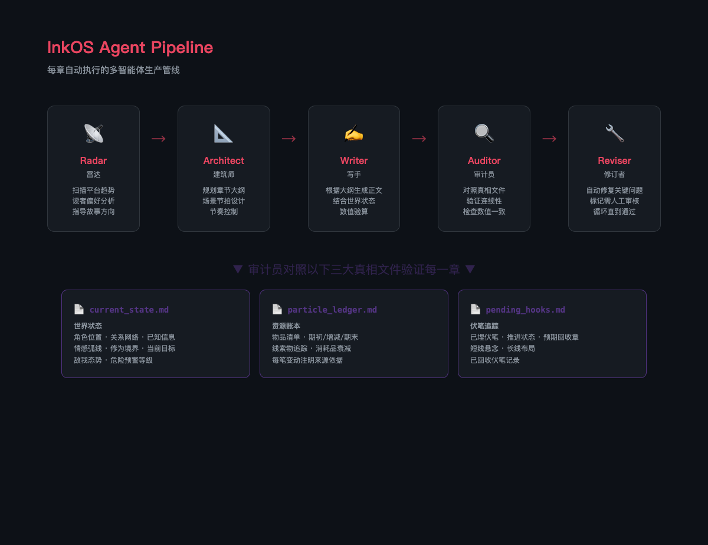
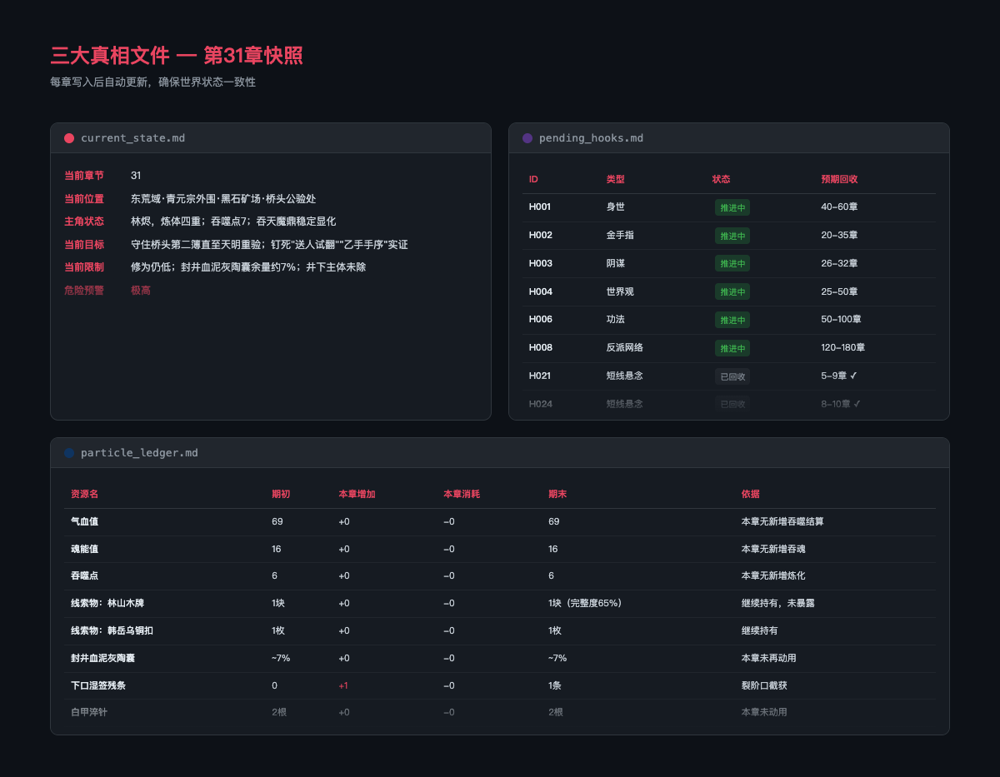
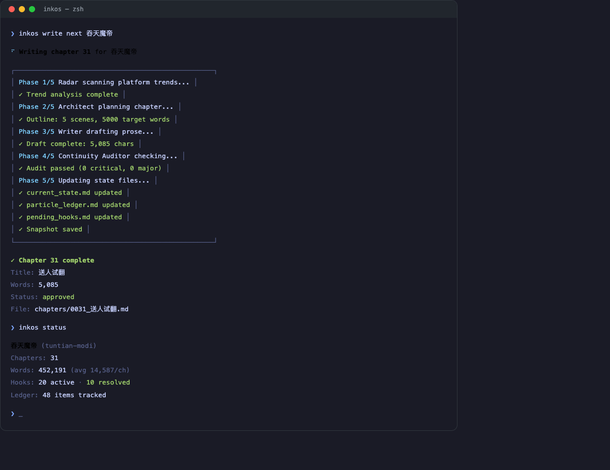

<p align="center">
  
</p>

<h1 align="center">InkOS</h1>

<p align="center">
  <strong>多智能体网文生产系统</strong>
</p>

<p align="center">
  <a href="LICENSE"></a>
  <a href="https://nodejs.org/"></a>
  <a href="https://pnpm.io/"></a>
  <a href="https://www.typescriptlang.org/"></a>
</p>

<p align="center">
  中文 | <a href="README.en.md">English</a>
</p>

---

开源多智能体网文生产系统。AI 智能体自主完成写作、审计、修订的完整流程 — 人类审核门控让你始终掌控全局。

## 为什么需要 InkOS？

用 AI 写小说不是简单的"提示词 + 复制粘贴"。长篇小说很快就会崩：角色记忆混乱、物品凭空出现、同样的形容词每段都在重复、伏笔悄无声息地断掉。InkOS 把这些当工程问题来解决。

- **三大真相文件** — 追踪世界的真实状态，而非 LLM 的幻觉
- **反信息泄漏** — 确保角色只知道他们亲眼见证过的事
- **资源衰减** — 物资会消耗、物品会损坏，没有无限背包
- **词汇疲劳检测** — 在读者发现之前就捕捉过度使用的词语
- **自动修订** — 在人工审核之前修复数值错误和连续性断裂

## 工作原理

InkOS 为每一章运行多智能体管线：

<p align="center">
  
</p>

| 智能体 | 职责 |
|--------|------|
| **雷达 Radar** | 扫描平台趋势和读者偏好，指导故事方向 |
| **建筑师 Architect** | 规划章节结构：大纲、场景节拍、节奏控制 |
| **写手 Writer** | 根据大纲 + 当前世界状态生成正文 |
| **连续性审计员 Auditor** | 对照三大真相文件验证草稿 |
| **修订者 Reviser** | 修复审计发现的问题 — 关键问题自动修复，其他标记给人工审核 |

如果审计不通过，管线自动进入"修订 → 再审计"循环，直到所有关键问题清零。

### 三大真相文件

每本书维护三个文件作为唯一事实来源：

| 文件 | 用途 |
|------|------|
| `current_state.md` | 世界状态：角色位置、关系网络、已知信息、情感弧线 |
| `particle_ledger.md` | 资源账本：物品、金钱、物资数量及衰减追踪 |
| `pending_hooks.md` | 未闭合伏笔：铺垫、对读者的承诺、未解决冲突 |

连续性审计员对照这三个文件检查每一章草稿。如果角色"记起"了从未亲眼见过的事，或者拿出了两章前已经丢失的武器，审计员会捕捉到。

<p align="center">
  
</p>

### 内置创作规则体系

写手 agent 内置了一套从大量网文创作实践中提炼的规则体系，覆盖 6 个维度：

- **人物塑造铁律** — 角色行为由"过往经历 + 当前利益 + 性格底色"共同驱动；配角必须有独立动机
- **叙事技法** — Show don't tell、五感代入法、每章结尾必须设置钩子、信息分层植入
- **逻辑自洽** — 三连反问自检、信息越界检查、关系改变必须事件驱动
- **语言约束** — 句式多样化、高疲劳词限制、情绪用细节传达
- **禁忌清单** — 禁止机械降神、反派降智、主角圣母、特定句式和标点
- **数值验算铁律** — 每次数值变动必须从账本取值验算，同质资源有衰减公式

每本书还有自己的 `style_guide.md`（文风指南）和 `story_bible.md`（世界观设定），由建筑师 agent 在创建书籍时生成。

## 快速开始

### 安装

```bash
git clone https://github.com/Narcooo/inkos.git
cd inkos
pnpm install
pnpm build
```

### 配置

```bash
cp .env.example .env
```

```env
OPENAI_API_KEY=sk-your-key-here
OPENAI_BASE_URL=https://api.openai.com/v1   # 或任何兼容端点
OPENAI_MODEL=gpt-4o

# 可选：通知推送
TELEGRAM_BOT_TOKEN=
TELEGRAM_CHAT_ID=
FEISHU_WEBHOOK_URL=
WECOM_WEBHOOK_URL=
```

### 使用

```bash
inkos init              # 初始化项目
inkos book create       # 创建新书（交互式，生成世界观+卷纲+文风指南）
inkos write next        # 写下一章（完整五 agent 管线）
inkos write rewrite <n> # 重写第 N 章（恢复状态快照后重新生成）
inkos status            # 查看状态（章数、字数、伏笔、账本）
inkos review            # 审阅草稿
inkos export <book-id>  # 导出全书
inkos up                # 守护进程模式，按计划自动写
```

<p align="center">
  
</p>

## 命令参考

| 命令 | 说明 |
|------|------|
| `inkos init` | 初始化项目 |
| `inkos book create` | 创建新书 |
| `inkos write next` | 智能体管线写下一章 |
| `inkos write rewrite <n>` | 重写第 N 章（恢复状态快照） |
| `inkos review` | 审阅并通过/拒绝草稿 |
| `inkos review approve-all <id>` | 批量通过所有待审章节 |
| `inkos status` | 项目状态 |
| `inkos export <id>` | 导出书籍为 txt/md |
| `inkos radar` | 扫描平台趋势 |
| `inkos config` | 查看/更新配置 |
| `inkos doctor` | 诊断配置问题 |
| `inkos up` | 启动守护进程模式 |
| `inkos down` | 停止守护进程 |

## 实测数据

用 InkOS 全自动跑了一本玄幻题材的《吞天魔帝》：

<p align="center">
  
</p>

| 指标 | 数据 |
|------|------|
| 已完成章节 | 31 章 |
| 总字数 | 452,191 字 |
| 平均章字数 | ~14,500 字 |
| 审计通过率 | 100% |
| 资源追踪项 | 48 个 |
| 活跃伏笔 | 20 条 |
| 已回收伏笔 | 10 条 |

## 核心特性

### 状态快照 + 章节重写

每章自动创建状态快照。使用 `inkos write rewrite <n>` 可以回滚并重新生成任意章节 — 世界状态、资源账本、伏笔钩子全部恢复到该章写入前的状态。

### 写入锁

基于文件的锁机制防止对同一本书的并发写入。

### 写前自检 + 写后结算

写手 agent 在动笔前必须输出自检表（上下文范围、当前资源、待回收伏笔、冲突概述、风险扫描），写完后输出结算表（资源变动、伏笔变动）。审计员对照结算表和正文内容做交叉验证。

### 守护进程模式

`inkos up` 启动自主循环，按计划写章。管线对非关键问题全自动运行，当审计员标记无法自动修复的问题时暂停等待人工审核。

### 通知推送

支持 Telegram、飞书、企业微信。守护进程模式下，写完一章或审计不通过都会推通知到手机。

## 项目结构

```
inkos/
├── packages/
│   ├── core/              # 智能体运行时、管线、状态管理
│   │   ├── agents/        # architect, writer, continuity, reviser, radar
│   │   ├── pipeline/      # runner (写→审→改), scheduler (守护进程)
│   │   ├── state/         # 基于文件的状态管理器
│   │   ├── llm/           # OpenAI 兼容接口 (流式)
│   │   ├── notify/        # Telegram, 飞书, 企业微信
│   │   ├── models/        # Zod schema 校验
│   │   └── prompts/       # 提示词模板
│   └── cli/               # Commander.js 命令行
│       └── commands/      # init, book, write, review, status, export 等
├── templates/             # 项目脚手架模板
└── (规划中) studio/        # 网页审阅编辑界面
```

TypeScript 单仓库，pnpm workspaces 管理。

## 路线图

- [x] 完整智能体管线（雷达 → 建筑师 → 写手 → 审计 → 修订）
- [x] 三大真相文件 + 连续性审计
- [x] 内置创作规则体系
- [x] CLI 全套命令
- [x] 状态快照 + 章节重写
- [x] 守护进程模式
- [x] 通知推送（Telegram / 飞书 / 企微）
- [ ] `packages/studio` Web UI 审阅编辑界面
- [ ] 多模型路由（不同 agent 用不同模型）
- [ ] 自定义 agent 插件系统
- [ ] 平台格式导出（起点、番茄等）

## 参与贡献

欢迎贡献代码。提 issue 或 PR。

```bash
pnpm install
pnpm dev          # 监听模式
pnpm test         # 运行测试
pnpm typecheck    # 类型检查
```

## 许可证

[MIT](LICENSE)
